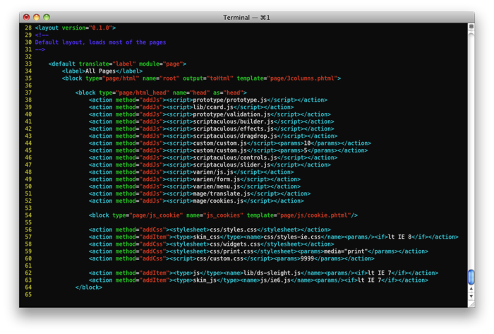

# `Markshust_Sortcssjs`

The Sort CSS JS Extension allows you to change the load order of stylesheet and javascript files from within the xml layer. This extension is as simple as adding a number to the params tag with the load order number of where you want the load the file, 1 being the first file to load, and 9999 being the last file to load. If an integer is not defined in the params tag, it will use Magento's built in method of loading css files and/or the default settings for param values.

